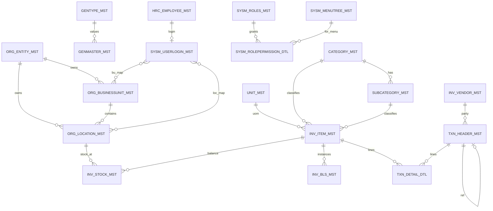
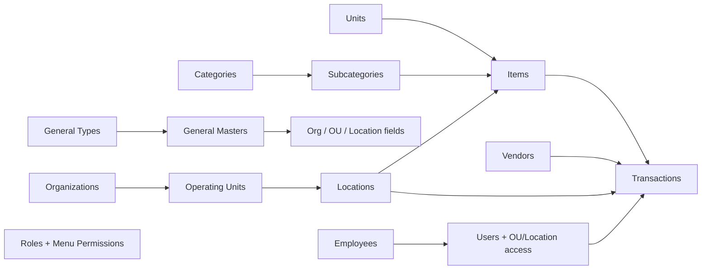
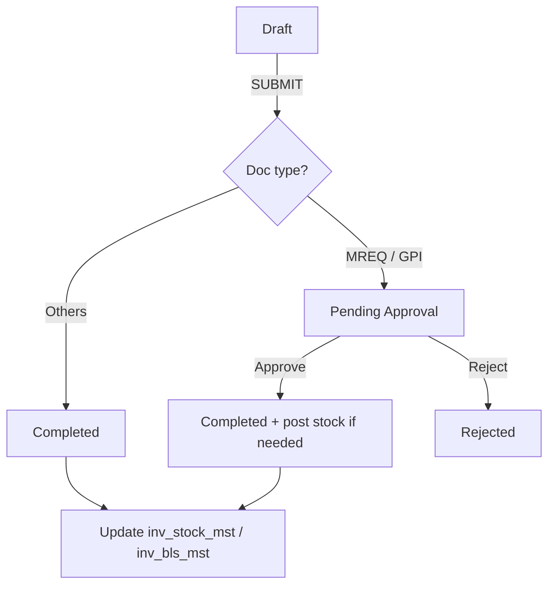
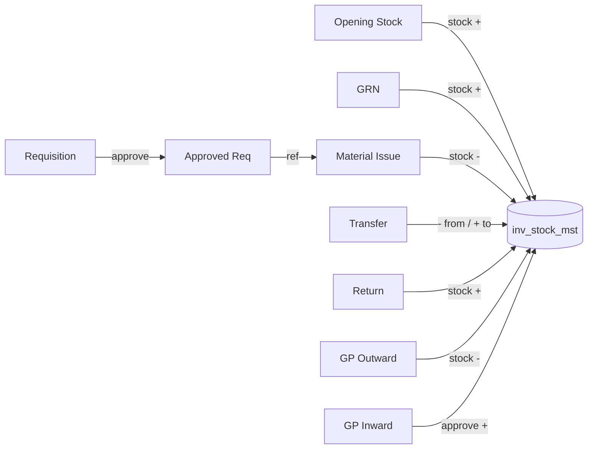
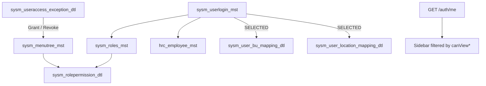
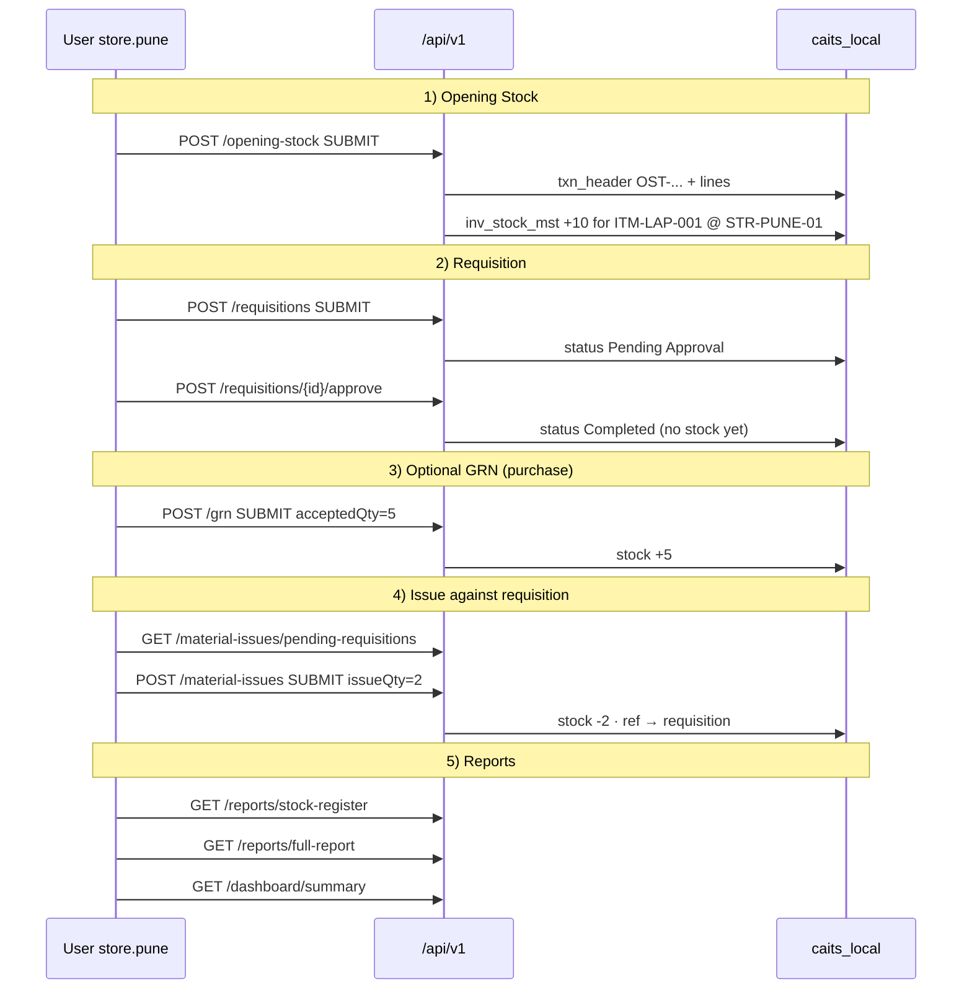
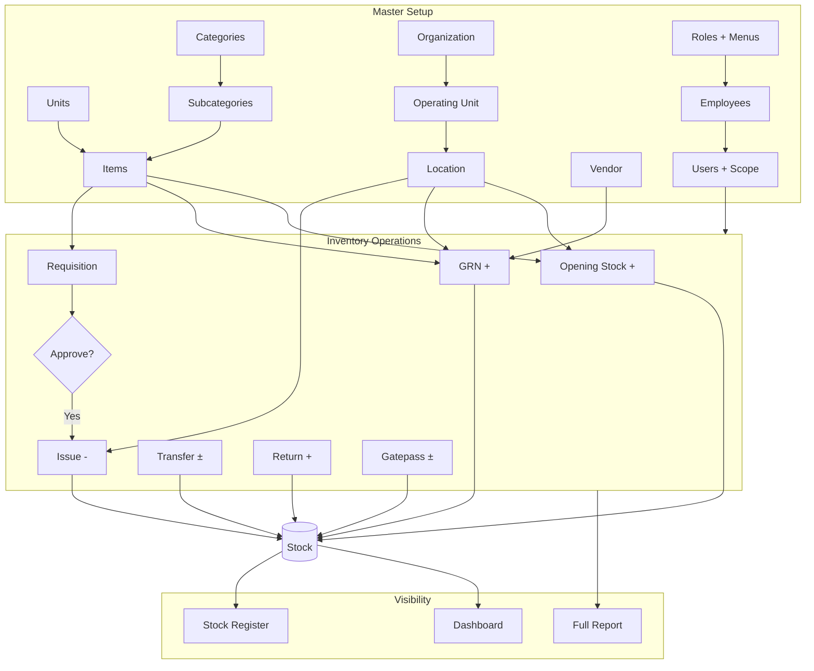

# CAITS — Full System Workflow, Schema & Documentation

> **Read-only analysis.** No database schema, data, or API contracts were changed while producing this document.  
> **Scope:** Frontend pages/components, backend APIs, PostgreSQL schema `caits_local`, masters, transactions, stock, reports.  
> **Example data** below is **illustrative only** (for walkthroughs / flowcharts). It was not inserted into any database.

---

## 1. System overview

**CAITS (Asset Tracking & Management)** is a React + Spring Boot inventory system:

| Layer | Stack |
|-------|--------|
| Frontend | React 19, Vite, React Router, Tailwind, `motion` |
| Backend | Spring Boot 3.3, JPA/Hibernate, JWT security |
| Database | PostgreSQL schema **`caits_local`** (`ddl-auto: validate`) |
| API base | `http://localhost:8085/api/v1` |

### High-level architecture

```mermaid
flowchart TB
  subgraph UI["Frontend (Vite :5173)"]
    Login[LoginPage]
    Shell[AppShell + Sidebar + Topbar]
    Masters[Master Pages]
    Txns[Transaction Pages]
    Reports[Reports + Dashboard]
  end

  subgraph API["Backend /api/v1"]
    Auth[/auth]
    MAPI[Masters Controllers]
    TAPI[Transaction Controllers]
    RAPI[Reports + Dashboard + Files]
  end

  subgraph DB["PostgreSQL · caits_local"]
    MST[Master tables]
    TXN[txn_header_mst + txn_detail_dtl]
    STK[inv_stock_mst + inv_bls_mst]
    SEC[roles · menus · users · mappings]
  end

  Login --> Auth
  Shell --> Auth
  Masters --> MAPI
  Txns --> TAPI
  Reports --> RAPI
  Auth --> SEC
  MAPI --> MST
  TAPI --> TXN
  TAPI --> STK
  RAPI --> STK
  RAPI --> TXN
```

---

## 2. Application map (pages ↔ routes ↔ APIs)

### 2.1 Auth & shell

| UI | Route | APIs |
|----|-------|------|
| Login | `/login` | `POST /auth/login` |
| Session | (all shell) | `GET /auth/me` |
| Profile modal | Topbar | `GET /auth/profile`, `POST /auth/change-password` |
| Favourites | Sidebar / Topbar | `GET/PUT /auth/favourites` |
| Logout | Topbar | `POST /auth/logout` |

### 2.2 Masters

| Menu | Path | Menu code | API resource |
|------|------|-----------|--------------|
| Unit | `/masters/units` | UOM | `/units` |
| Item | `/masters/items` | AIM | `/items` |
| Inventory Category | `/masters/inventory-categories` | ICM | `/categories` |
| Inventory Sub-Category | `/masters/inventory-sub-categories` | ISC | `/subcategories` |
| General Type | `/masters/general-types` | GTY | `/general-types` |
| General Master | `/masters/general-masters` | GNM | `/general-masters` |
| Vendor/Party | `/masters/vendors` | VPM | `/vendors` |
| Organization | `/masters/organizations` | ORG | `/entities` |
| Operating Unit | `/masters/operating-units` | OU | `/business-units` |
| Location / Store | `/masters/stores` | STR | `/locations` |
| Role & Menu Mapping | `/masters/roles` | ARM | `/roles`, `/roles/{id}/permissions`, `/menus` |
| Employee | `/masters/employees` | EMP | `/employees` |
| User Access Mapping | `/masters/users` | USR | `/users`, `/users/{id}/ou-access` |
| Access Exception | `/masters/exceptions` | UAE | `/access-exceptions` |

### 2.3 Transactions

| Menu | Path | Menu code | API |
|------|------|-----------|-----|
| Opening Stock | `/transactions/opening-stock` | OPN | `/opening-stock` |
| Store Requisitions | `/transactions/requisitions` | SR | `/requisitions` (+ approve/reject) |
| GRN | `/transactions/grn` | GRN | `/grn` |
| Gatepass | `/transactions/gatepass` | GP | `/gatepass/inward`, `/gatepass/outward` |
| Store Issue | `/transactions/issues` | ISS | `/material-issues` (+ pending-requisitions) |
| Material Transfer | `/transactions/transfers` | TRF | `/transfers` |
| Material Return | `/transactions/returns` | RTN | `/returns` |

### 2.4 Reports

| Menu | Path | Menu code | API |
|------|------|-----------|-----|
| Dashboard | `/dashboard` | DASH | `/dashboard/summary` |
| Stock Register | `/reports/stock-register` | STKREG | `/reports/stock-register` |
| Full Report | `/reports/full-report` | FULLRPT | `/reports/full-report` |

---

## 3. Database schema (tables, columns, relations)

**Schema:** `caits_local`  
**ORM note:** JPA stores **scalar FK integers/strings** (no `@ManyToOne`). Real FK constraints live in SQL migrations / dump.

### 3.1 Entity-relationship overview



### 3.2 Table catalog

#### Setup masters

| Table | PK | Key columns | FKs |
|-------|-----|-------------|-----|
| `unit_mst` | `unt_unit_id` | `unt_unit_code`, `unt_unit_name`, `unt_isactive` | — |
| `category_mst` | `cat_category_id` | code, name, isactive | — |
| `subcategory_mst` | `scat_subcategory_id` | code, name | `scat_category_id_cat` → category |
| `gentype_mst` | `gtyp_gentype_id` | `gtyp_type_code`, name | — |
| `genmaster_mst` | `gmst_genmaster_id` | value_code, value_name, sort_order | `gmst_gentype_id_gtyp` → gentype |

#### Organization

| Table | PK | Key columns | FKs |
|-------|-----|-------------|-----|
| `org_entity_mst` | `ent_entity_id` | entity code/name, GSTIN, city | — |
| `org_businessunit_mst` | `bu_bu_id` | bu code/name, bu_type | entity; manager → employee |
| `org_location_mst` | `loc_location_id` | location code/name, location_type | entity; bu; manager → employee |

#### Item / vendor / stock / BLS

| Table | PK | Key columns | FKs |
|-------|-----|-------------|-----|
| `inv_item_mst` | `itm_item_id` | item_code, item_type (Asset/Consumable), costs, serial/batch flags, IT fields | category, subcategory, uom, location, employee, parent item |
| `inv_vendor_mst` | `vnd_vendor_id` | vendor_code, party_type, GST, contact | — |
| `inv_stock_mst` | `stk_stock_id` | opening/inward/issued/…, **current_qty**, avg_rate, stock_value | item + location + uom; last txn header |
| `inv_bls_mst` | `ibm_bls_id` | batch/lot/serial, IP/MAC/hostname, condition, is_dummy | entity, item, current location |

#### Security / people

| Table | PK | Key columns | FKs |
|-------|-----|-------------|-----|
| `sysm_menutree_mst` | `mtree_menu_id` | **menu_code**, label, group, sort | — |
| `sysm_roles_mst` | `rol_role_id` | role_code, role_level | — |
| `sysm_rolepermission_dtl` | `rlpm_role_permission_id` | can_view/create/edit/delete/approve/reject/print/export | role, menu |
| `hrc_employee_mst` | `emp_employee_id` | emp_code, name, dept, desig, email | role, base location, reporting_to |
| `sysm_userlogin_mst` | `usr_user_id` | login_id, password_hash, bu_access_scope, location_access_scope | employee (1:1), role, entity, default location |
| `sysm_user_bu_mapping_dtl` | `uboa_user_bu_access_id` | — | user ↔ bu (M:N) |
| `sysm_user_location_mapping_dtl` | `uloc_user_loc_access_id` | — | user ↔ location (M:N) |
| `sysm_useraccess_exception_dtl` | `uexc_exception_id` | Grant/Revoke, dates | employee, menu_code |
| `sysm_user_favourite_menu_dtl` | `ufav_favourite_id` | sort_order | user, menu_code |

#### Transactions (shared for all doc types)

| Table | PK | Key columns | FKs |
|-------|-----|-------------|-----|
| `txn_header_mst` | `txh_txn_header_id` | **doc_type**, **doc_no**, dates, status, totals, remarks, invoice/PO | entity, locations (store/from/to), party→vendor, department→genmaster, employee refs, **ref_txn_header** self |
| `txn_detail_dtl` | `txd_txn_detail_id` | sr_no, qty variants, rate/amount, batch, serial/IP/MAC | header, item, uom, location, bls |

### 3.3 Document types in `txn_header_mst`

| DocType | Stored value | Doc series | REST |
|---------|--------------|------------|------|
| Opening Stock | `OPENING_STOCK` | OST | `/opening-stock` |
| Requisition | `MATERIAL_REQUISITION` | MREQ | `/requisitions` |
| GRN | `GRN` | GRN | `/grn` |
| Gatepass Inward | `GATEPASS_INWARD` | GPI | `/gatepass/inward` |
| Gatepass Outward | `GATEPASS_OUTWARD` | GPO | `/gatepass/outward` |
| Material Issue | `MATERIAL_ISSUE` | MISS | `/material-issues` |
| Transfer | `MATERIAL_TRANSFER` | MTRF | `/transfers` |
| Return | `MATERIAL_RETURN` | MRET | `/returns` |

---

## 4. How masters work (fields, dependencies, UI)

### 4.1 Recommended master setup order



### 4.2 Master field ↔ API mapping (summary)

| Master | UI fields (typical) | API body highlights |
|--------|---------------------|---------------------|
| **Unit** | Code, Name, Description, Status | `unitCode`, `unitName`, `desc`, `isActive` |
| **Category** | Code, Name, Desc, Status | `categoryCode`, `categoryName` |
| **Sub-category** | Code, Name, **Parent Category**, Status | `subcategoryCode`, `categoryId` |
| **General Type** | Type Code, Name, Desc | `typeCode`, `typeName` |
| **General Master** | Value Code/Name, **Type**, Sort | `valueCode`, `gentypeId`, `sortOrder` |
| **Organization** | Code, Name, Short Name, City, GSTIN | `entityCode`, `entityName`, … |
| **Operating Unit** | Code, Name, **Org**, OU Type, City | `buCode`, `entityId`, `buType` |
| **Location** | Code, Name, Store Type, **Org**, **OU** | `locationCode`, `entityId`, `buId`, `locationType` |
| **Item** | Code, Name, Type Asset/Consumable, Cat/Sub/UOM, costs, tracking flags, IT fields | Full `items` DTO |
| **Vendor** | Code, Name, Party Type, tax, address, contact | `vendorCode`, `partyType`, … |
| **Role** | Code, Name, Level + **permission matrix** | `roles` + `PUT /roles/{id}/permissions` |
| **Employee** | Code, Name, Dept, Desig, email, optional **create login** | `employees` (+ login fields) |
| **User** | Employee, Login, Role, Org, **OU scope**, **Location scope** | `users` + `PUT .../ou-access` |
| **Exception** | Employee, Type Grant/Revoke, Menu, dates | `access-exceptions` |

### 4.3 Lookup source for dropdowns

Most master forms use **`GET /general-types/{typeCode}/values`** (e.g. `GTY-OUTYPE`, `GTY-STRTYPE`, `GTY-GENDER`, `GTY-PARTY`, `GTY-DOCTYPE`, `GTY-DOCSTAT`, `GTY-STKSTAT`).

Transaction forms additionally use **`LookupSelect`** with optional quick-add (`POST /locations`, `/employees`, `/vendors`, `/general-types/{type}/values`).

### 4.4 UI patterns

1. **SimpleMasterModule** — Units, categories, orgs, OUs, locations, gen types/masters, roles, users, exceptions, **Transfers**, **Returns**.
2. **Custom multi-section forms** — Items, Vendors, Employees.
3. **Custom list + multi-line grids** — Opening Stock, Requisition, GRN, Issue.
4. **Tabbed create screen** — Gatepass (inward / outward).

---

## 5. How transactions work (fields, status, stock)

### 5.1 Shared document request shape

All txn APIs use a **DocumentRequest**-style body:

- Header fields (dates, location/party/employees, remarks, attachment…)
- `lines[]` (item, qty, rate, batch/serial…)
- `docSubmitAction`: `SAVE_DRAFT` | `SUBMIT`

### 5.2 Status & stock posting rules

| Doc type | On SUBMIT status | Posts stock on submit? | Stock sign | Notes |
|----------|------------------|------------------------|------------|-------|
| Opening Stock | Completed | Yes | **+** | Seeds `inv_stock_mst` |
| Requisition | **Pending Approval** | No | 0 | Approve/Reject; stock later via Issue |
| GRN | Completed | Yes | **+** (accepted qty) | No approval workflow |
| Gatepass Inward | Pending Approval | On **approve** | **+** | Approval gated |
| Gatepass Outward | Completed | Yes | **−** | |
| Material Issue | Completed | Yes | **−** | Usually linked to approved requisition |
| Transfer | Completed | Yes | **−** source / **+** dest | |
| Return | Completed | Yes | **+** | |



### 5.3 Transaction field highlights

#### Opening Stock (`OPN`)
**Header:** opening date, org (`entityId`), store (`locationId`), remarks  
**Lines:** item, qty, rate, batch, serial / IT fields  

#### Store Requisition (`SR`)
**Header:** req type (DEPARTMENT|EMPLOYEE), dates, department, requestedBy, deliverTo location, employee, attachment  
**Lines:** item, requestedQty  
**Actions:** Save Draft / Submit → Approve / Reject  

#### GRN
**Header:** date, supplier (`partyId`), invoice/PO, store, inspected/prepared/approved by + dates  
**Lines:** ordered/received/accepted/rejected qty, rates, batch, asset fields  
**Stock:** posts **accepted** quantity on submit  

#### Store Issue (`ISS`)
**Header:** issue date, `requisitionId` → `refTxnHeaderId`, store, issuedTo  
**Lines:** issueQty, batch, available stock check  
**Lookup:** `GET /material-issues/pending-requisitions`  

#### Transfer (`TRF`)
fromStore, toStore, item, qty, uom, batch  

#### Return (`RTN`)
returnedBy, store, item, qty, uom, batch  

#### Gatepass
**Inward:** store, preparedBy, item, qty; may reference returnable outward  
**Outward:** returnFlag, party text in remarks  

### 5.4 Cross-document links



---

## 6. Security, scope & menus



- **Menu ACL:** role flags; **Revoke** removes; **Grant** adds (date-bounded).  
- **Data scope:** `buAccessScope` / `locationAccessScope` = `ALL` | `SELECTED`.  
- **ADMIN** (configurable) bypasses location/OU filters.  
- **Favourites:** up to 12 menu codes in `sysm_user_favourite_menu_dtl`.

---

## 7. Example end-to-end workflow (illustrative data)

> **Important:** The following IDs, codes, and quantities are **sample narrative data** for documentation and flowcharts. They were **not written** to the database and do not change APIs.

### 7.1 Master setup (Day 0) — sample records

| Step | Master | Example values |
|------|--------|----------------|
| 1 | Unit | `NOS` — Numbers |
| 2 | Category | `IT-HW` — IT Hardware |
| 3 | Sub-category | `LAPTOP` under IT-HW |
| 4 | Gen types/values | OU types, store types, party types, gender, dept, desig already seeded (`GTY-*`) |
| 5 | Organization | `CAITS-HQ` — CAITS Headquarters, City Pune |
| 6 | Operating Unit | `OU-PUNE` under CAITS-HQ, type Regional |
| 7 | Location | `STR-PUNE-01` — Pune Main Store (type Store) |
| 8 | Vendor | `VND-ACME` — ACME Supplies, party type Supplier |
| 9 | Item | `ITM-LAP-001` — Dell Latitude 5440, Asset, UOM NOS, Cat IT-HW / Sub LAPTOP |
| 10 | Role | `STOREKEEPER` with view/create on OPN, SR, GRN, ISS, STKREG |
| 11 | Employee | `EMP-1001` System Storekeeper |
| 12 | User | login `store.pune` → employee EMP-1001, role STOREKEEPER, location scope SELECTED → STR-PUNE-01 |

### 7.2 Operational flow (Day 1–3)



### 7.3 Example field payloads (illustrative)

**Opening Stock submit (concept):**

```json
{
  "openingDate": "2026-08-01",
  "entityId": 1,
  "locationId": 10,
  "remarks": "Initial IT stock",
  "docSubmitAction": "SUBMIT",
  "lines": [
    { "itemId": 100, "qty": 10, "rate": 65000, "uomId": 1 }
  ]
}
```

**Effect on stock register (concept):**

| Item | Location | Current Qty | Source |
|------|----------|-------------|--------|
| ITM-LAP-001 | STR-PUNE-01 | 10 | Opening Stock |
| after GRN +5 | STR-PUNE-01 | 15 | GRN accepted |
| after Issue −2 | STR-PUNE-01 | 13 | Material Issue |

**Requisition → Issue chain (concept):**

| Doc | Doc No (example) | Status | Stock |
|-----|------------------|--------|-------|
| MREQ | MREQ/2026/0001 | Approved/Completed | none |
| MISS | MISS/2026/0001 | Completed | −2 @ store | `refTxnHeaderId` = MREQ |

### 7.4 Full business flowchart (masters → txns → reports)



---

## 8. Reports — what they show

| Report | Endpoint | Typical filters | Data source |
|--------|----------|-----------------|-------------|
| **Dashboard** | `GET /dashboard/summary` | (scoped) | Counts + low stock + recent stock rows |
| **Stock Register** | `GET /reports/stock-register` | search, categoryId, locationId | `inv_stock_mst` (+ item/location) |
| **Full Report** | `GET /reports/full-report` | docType, from/to date, locationId | `txn_header_mst` / details trail |

**Example Stock Register row (after sample flow):**

| Item Code | Item Name | Location | Qty | UOM | Status |
|-----------|-----------|----------|-----|-----|--------|
| ITM-LAP-001 | Dell Latitude 5440 | STR-PUNE-01 | 13 | NOS | In Stock |

**Example Full Report rows:**

| Doc Type | Doc No | Date | Location | Status |
|----------|--------|------|----------|--------|
| OPENING_STOCK | OST/… | 2026-08-01 | STR-PUNE-01 | Completed |
| MATERIAL_REQUISITION | MREQ/… | 2026-08-02 | STR-PUNE-01 | Completed |
| GRN | GRN/… | 2026-08-02 | STR-PUNE-01 | Completed |
| MATERIAL_ISSUE | MISS/… | 2026-08-03 | STR-PUNE-01 | Completed |

---

## 9. Component & connection checklist

| Area | Key components | Connects to |
|------|----------------|-------------|
| Shell | `AppShell`, `Sidebar`, `Topbar` | `/auth/me`, favourites, profile |
| Masters list/form | `SimpleMasterModule`, `DataTable`, `Field` | `api/masters` → CRUD resources |
| Item/Vendor/Employee | Custom pages | hydrate `GET /{resource}/{id}` |
| Role permissions | `RoleMenuAccessPanel` | `/menus`, `/roles/{id}/permissions` |
| Txn multi-line | `*ItemLines`, `lineGrid`, `txnLookups` | txn APIs + `/stock` |
| Lookups | `LookupSelect` | masters + quick-add POSTs |
| Auth | `AuthContext`, `LoginPage`, `ProfileModal` | `/auth/*` |
| Reports | `StockRegisterPage`, `FullReportPage`, `DashboardPage` | `/reports/*`, `/dashboard/summary` |
| Loader | `GlobalLoader`, `MorphingInfinity` | pending API/nav counter |

---

## 10. Integrity rules (operational)

1. **Masters before transactions** — items, locations, vendors, employees must exist (or quick-add from txn screens).  
2. **Location scope** — non-ADMIN users only see/write allowed locations/BUs.  
3. **Requisition does not move stock** — Issue (or other posting docs) does.  
4. **GRN posts accepted qty** immediately on submit.  
5. **Serial/BLS inbound** — inbound docs must not re-receive a serial already claimed (`inv_bls_mst` / line fields).  
6. **Schema validate-only** — Hibernate will not create/alter tables; use `db_approach` SQL migrations for schema changes (not done in this analysis).

---

## 11. Related project artifacts

| Path | Purpose |
|------|---------|
| `db_approach/` | SQL alters, seeds, dump |
| `metadata/` | Feature & migration metadata |
| `CAIMS_Relational_Schema.md` / ER PDF | Historical schema docs |
| `frontend/src/config/navigation.ts` | Menu paths + menu codes |
| `backend/.../StockPostingRules.java` | Authoritative stock/status rules |

---

*Generated from static code/schema analysis. Example workflow data is fictional for documentation only — no DB or API modifications were made.*
