# CAITS — Product Functional Guide

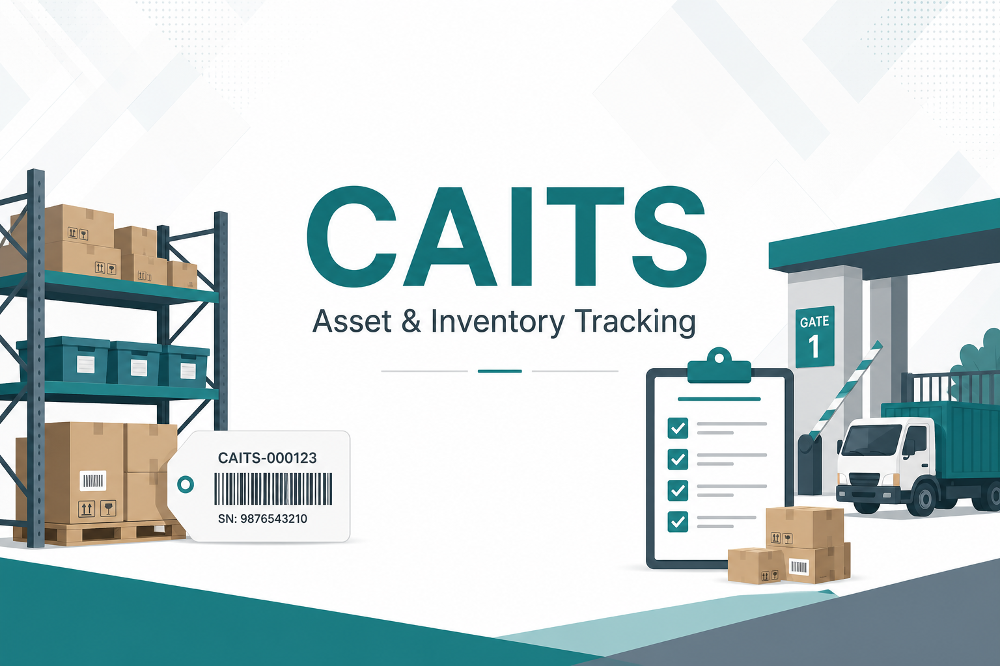

**CAITS** (Centralized Asset and Inventory Tracking System) helps teams manage inventory and serialized assets across organizations, operating units, and store locations — from receipt and inspection through issue, transfer, return, and gatepass.

| | |
|---|---|
| 🖥️ **Frontend** | React + Vite (`http://localhost:5173`) |
| ⚙️ **Backend** | Spring Boot + JWT (`http://localhost:8085/api/v1`) |
| 🗄️ **Database** | PostgreSQL schema `caits_local` |

> This guide focuses on **flows and functionality**. For schema/API depth, see [`CAITS_FULL_SYSTEM_DOCUMENTATION.md`](CAITS_FULL_SYSTEM_DOCUMENTATION.md).

---

## 📑 Contents

1. [Who uses it](#1--who-uses-it)
2. [Core concepts](#2--core-concepts)
3. [Master setup](#3--master-setup-recommended-order)
4. [End-to-end business flows](#4--end-to-end-business-flows)
5. [Reports & Dashboard](#5--reports--dashboard)
6. [Business rules cheat sheet](#6--common-business-rules-cheat-sheet)
7. [Suggested demo walkthrough](#7--suggested-demo-walkthrough)
8. [Related docs](#8--related-docs-in-this-repo)

---

## 1. 👥 Who uses it

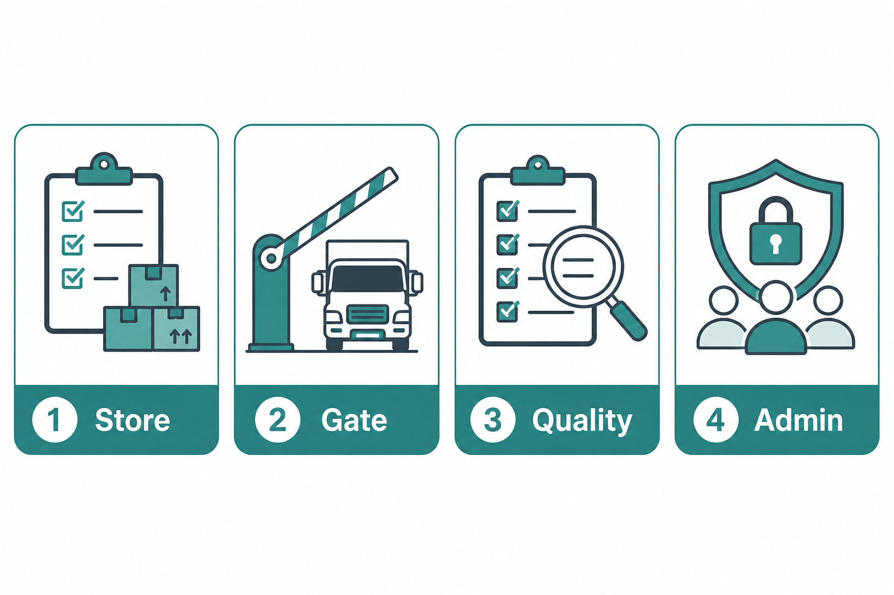

| Icon | Role area | Typical use |
|:----:|-----------|-------------|
| 📦 | **Store / inventory** | Opening stock, GRN, issue, transfer, return, stock ledgers |
| 🚧 | **Gate / logistics** | Gatepass inward & outward, returnable materials |
| 🔍 | **Quality** | Inspection approval (quarantine → home store / rejected) |
| 🛡️ | **Admin** | Masters, roles, users, location access, exceptions |

Access is controlled by **Role & Menu Mapping** (view / create / edit / delete / approve / print / export), plus optional **User Access Exceptions** and **OU / location scope** on the user.

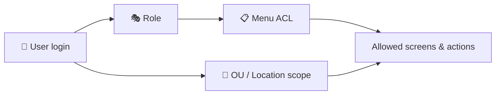

---

## 2. 🧩 Core concepts

### 2.1 Assets vs consumables

| Type | Tracking | Typical behaviour |
|------|----------|-------------------|
| **🖥 Asset** | Often serialized (1 unit = 1 serial) | Serial on receive/issue/return/outward; custody on BLS |
| **📦 Consumable** | Qty / optional batch | Stock quantity increases/decreases at locations |

### 2.2 Stock vs BLS

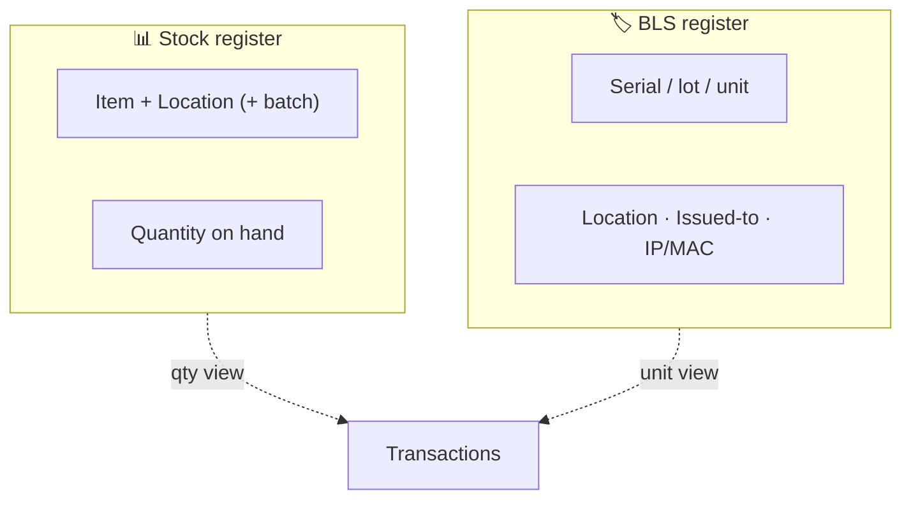

| Register | What it answers |
|----------|-----------------|
| **Stock** (`inv_stock_mst`) | *How much* is at a location? |
| **BLS** (`inv_bls_mst`) | *Which unit / serial* is where, and who holds it? |

### 2.3 Organization & system locations

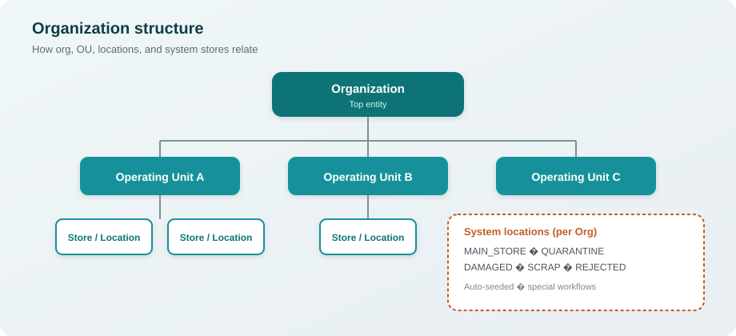

| System location | Purpose |
|-----------------|---------|
| 🏪 **MAIN_STORE** | Default system store |
| ⏸️ **QUARANTINE** | Inspection-needed receipts wait here |
| ⚠️ **DAMAGED** | Damaged material |
| 🗑️ **SCRAP** | Scrap |
| ❌ **REJECTED** | Rejected at GRN or after failed inspection |

Operational **Locations** belong to Operating Units and are used for day-to-day store work.

### 2.4 Inspection needed

On **Item Master**, set **Inspection Needed**. On GRN / Gatepass Inward submit:

1. Accepted qty → **Quarantine**
2. **Pending Inspection Approval** for the assigned inspector
3. **Approve** → item **home store** · **Reject** → **Rejected**

### 2.5 Document lifecycle

| Action | Result |
|--------|--------|
| 💾 **Save Draft** | Editable draft / pending |
| ✅ **Submit** | Posts stock (where applicable) and finalizes |

Document numbers: `PREFIX-YEAR-NNNN` — e.g. `GRN-2026-0001`, `GPO-2026-0003`.

---

## 3. 🧱 Master setup (recommended order)

Set masters in this order so transactions have the data they need:

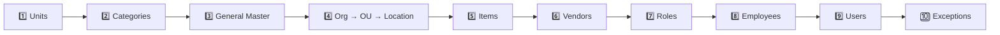

| Step | Master | Why |
|:----:|--------|-----|
| 1️⃣ | **Unit Master** | UOMs |
| 2️⃣ | **Inventory Category / Sub-Category** | Item classification |
| 3️⃣ | **General Type / General Master** | Lookups (returnable, purposes…) |
| 4️⃣ | **Organization → OU → Location** | Structure + system stores |
| 5️⃣ | **Item Master** | Type, serial/batch, home store, inspection |
| 6️⃣ | **Vendor / Party** | Suppliers & parties |
| 7️⃣ | **Role & Menu Mapping** | Screen permissions |
| 8️⃣ | **Employee / Department** | People & teams |
| 9️⃣ | **User Access Mapping** | Login, role, scope |
| 🔟 | **User Access Exception** | Optional overrides |

---

## 4. 🔄 End-to-end business flows

### 4.1 High-level stock journey

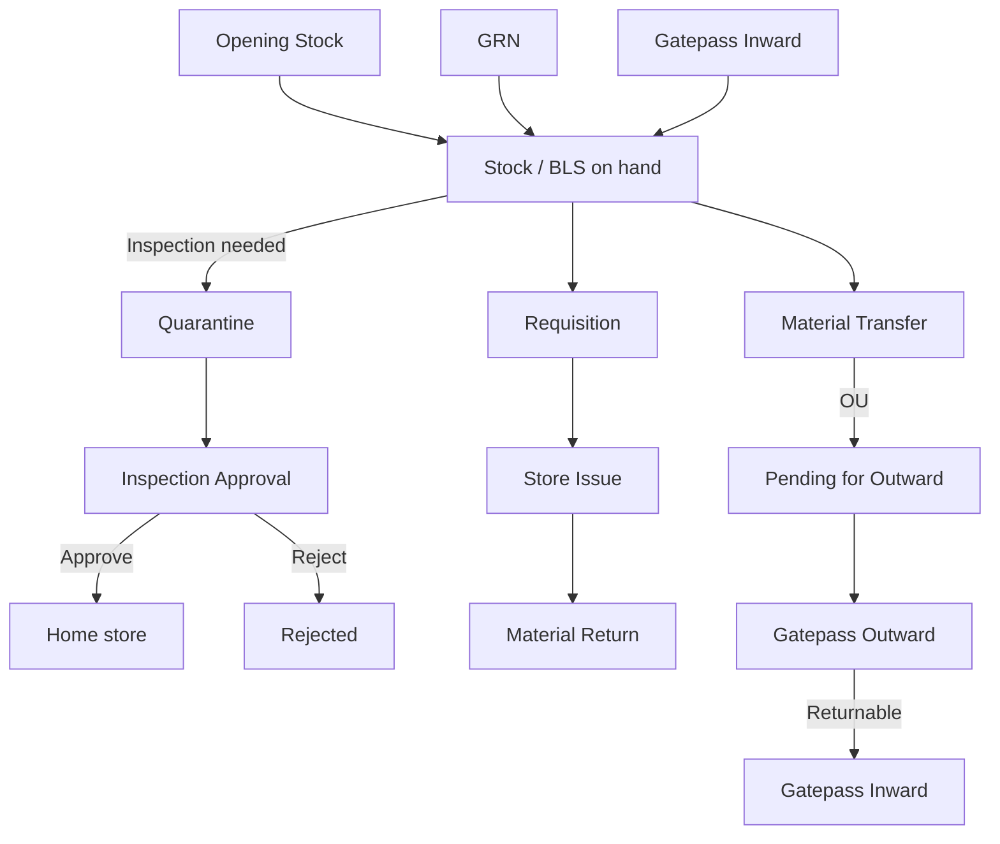

---

### 4.2 📥 Opening Stock (OPN)

**Purpose:** Seed opening balances.

| Step | Action |
|:----:|--------|
| 1️⃣ | Create entry: organization, store, date, item lines |
| 2️⃣ | Assets → serials · Consumables → qty (+ optional batch) |
| 3️⃣ | Submit → stock **increases**; BLS created/resolved |

> ⚠️ Duplicate serials already in the system are rejected (first-time inbound).

---

### 4.3 🧾 Goods Receipt Note — GRN

**Purpose:** Receive material from a **supplier / vendor**.

| Step | Action |
|:----:|--------|
| 1️⃣ | Header: supplier, invoice/PO refs, store, inspector if needed |
| 2️⃣ | Lines: received / accepted / rejected qty; serials for assets |
| 3️⃣ | Submit |

**Where accepted / rejected qty goes:**

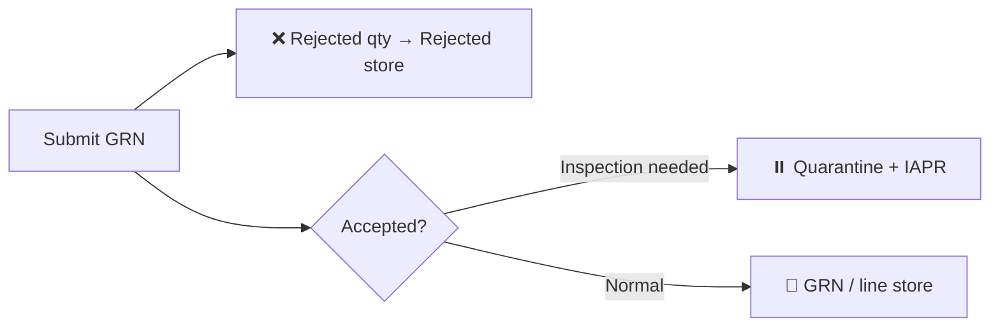

| Qty | Destination |
|-----|-------------|
| Rejected | **Rejected** system store |
| Accepted + Inspection Needed | **Quarantine** (+ pending Inspection Approval) |
| Accepted otherwise | GRN / line store |

**Requires:** Inspected By when any accepted line needs inspection; item must have a **home store**.

---

### 4.4 🔍 Inspection Approval (IAPR)

**Purpose:** Clear quarantine after GRN or Gatepass Inward.

| Step | Action |
|:----:|--------|
| 1️⃣ | System creates **Pending** approval linked to source document |
| 2️⃣ | Assigned inspector opens Inspection Approvals |
| 3️⃣ | **Approve** → Quarantine → home store |
| 4️⃣ | **Reject** → Quarantine → Rejected store |

> 🔐 Only the assigned inspector (or ADMIN) may approve/reject.

---

### 4.5 📝 Store Requisition (SR)

**Purpose:** Request material — **does not move stock**.

| Step | Action |
|:----:|--------|
| 1️⃣ | Return-from type: Employee or Department |
| 2️⃣ | Select items/locations with available stock |
| 3️⃣ | Submit → status **Requested** |

Downstream: Store Issue picks **Requested** requisitions → after issue, requisition becomes **Issued**.

---

### 4.6 📤 Store Issue (ISS)

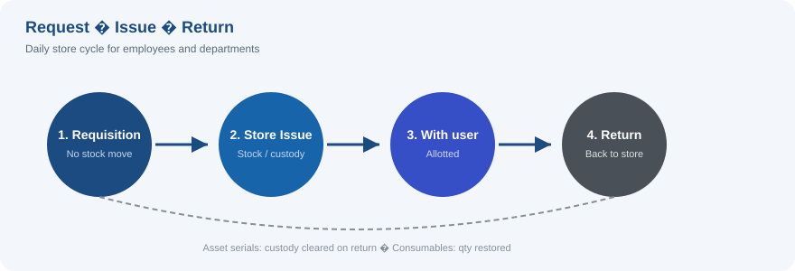

**Purpose:** Issue material from a store against a requisition.

| Step | Action |
|:----:|--------|
| 1️⃣ | New Issue → pick a **Requested** requisition |
| 2️⃣ | Confirm From Location, Issued To, To Location |
| 3️⃣ | Lines: issue qty; assets need free serials at From Location |
| 4️⃣ | Submit → **Issued** |

| Item type | On submit |
|-----------|-----------|
| 📦 Consumables | Quantity leaves the issuing store |
| 🖥 Assets (same store) | On-hand qty often unchanged; BLS **issued-to** employee |
| 📍 Different destination | Stock moves From → To |

Sidebar highlights **Store Issue** for all `/transactions/issues/*` routes.

---

### 4.7 🔀 Material Transfer (TRF)

**Purpose:** Move stock between locations.

| Type | Behaviour |
|------|-----------|
| 🏠 **INTERNAL** | Submit → stock moves → **Transferred** |
| 🏢 **OU** | Submit → stock moves → **Pending for Outward** until Gatepass Outward → **Transferred** |

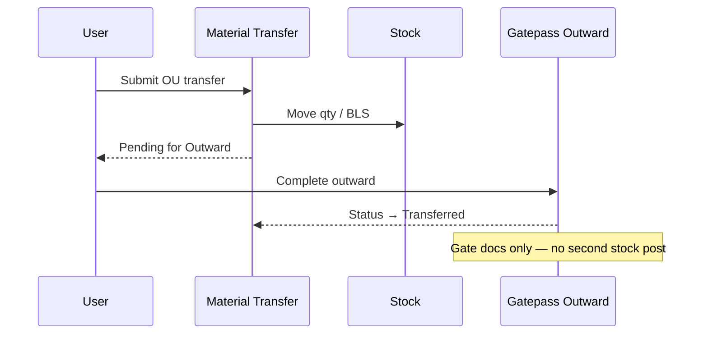

**Rules:**

- Cannot transfer inspection-needed items **into Damaged/Scrap** (use Quarantine / inspection).
- Linked Gatepass Outward is **gate documentation only** (does not post stock again).

---

### 4.8 ↩️ Material Return (RTN)

**Purpose:** Return allotted material to store.

| Step | Action |
|:----:|--------|
| 1️⃣ | Return From: Employee or Department |
| 2️⃣ | Pick allotted item (and serial for assets) |
| 3️⃣ | Return-to store = Item Master home store |
| 4️⃣ | Submit → **Returned**; stock back; BLS custody cleared |

---

### 4.9 🚧 Gatepass (GP)

One menu covers **Outward** and **Inward**.

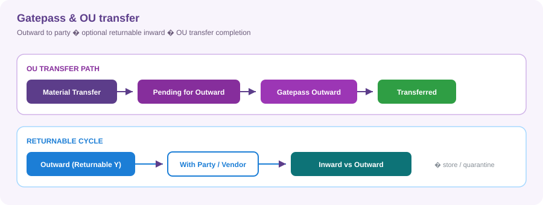

#### Outward ➡️

| Mode | Purpose |
|------|---------|
| **New / standalone** | From a **system** location to a vendor/party; Returnable Y/N |
| **Against transfer** | Completes OU transfer; party/store from transfer |

| Rule | Detail |
|------|--------|
| ✅ Mandatory | Vendor / Party / Customer (free text) |
| ✨ Prefill | Party can come from source GRN / Opening Stock vendor |
| 🚫 Block | Inspection-needed items from Quarantine / Damaged / Scrap until inspected |

#### Inward ⬅️

| Mode | Purpose |
|------|---------|
| **Against Returnable Outward** | Bring returnable material back |
| **New Inward** | Fresh gate receipt from Item Master |

| Rule | Detail |
|------|--------|
| ✅ Mandatory | Vendor / Party / Customer · Serial for assets |
| 👤 Inspector list | Employees who have a **role** assigned |

**Receive location:**

| Situation | Location |
|-----------|----------|
| New inward, no inspection | Item home store |
| Inspection needed (new **or** returnable) | **Quarantine** (+ Inspection Approval) |
| Returnable, no inspection | Outward system store |

---

## 5. 📊 Reports & Dashboard

| Icon | Screen | What you get |
|:----:|--------|----------------|
| 🏠 | **Dashboard** | KPIs, pending work, low stock, recent activity |
| 📒 | **Stock Ledger** | Opening / receipts / issues / closing; expand units |
| 📜 | **Log Report** | Transaction activity (filters include serial) |
| 👤 | **Stock Owner Report** | Where stock sits and who holds custody |
| 🗺️ | **Asset Movement Register** | How assets moved across locations/custodians |
| 📈 | **Item Ledger** | Running balance by document for an item |

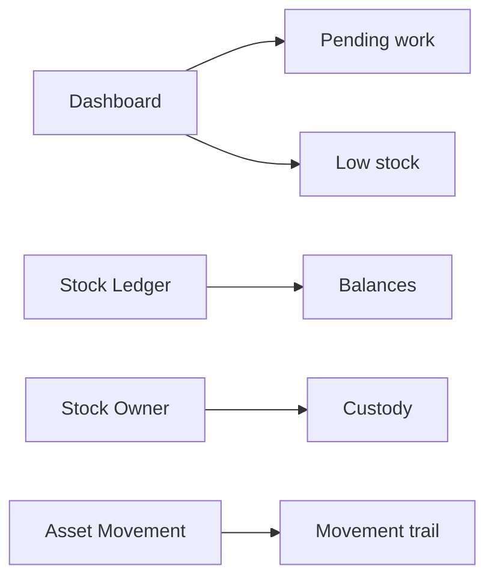

---

## 6. ✅ Common business rules (cheat sheet)

| Icon | Topic | Rule |
|:----:|-------|------|
| 🔢 | Serials | Required for serialized/asset lines on receive, issue, return, gatepass |
| 🚫 | Duplicate serial | Blocked on GRN / Opening Stock; Return & GPI reuse BLS |
| ⏸️ | Inspection | Quarantine → Inspection Approval → Home or Rejected |
| ✍️ | Gatepass party | Mandatory on inward and outward |
| 🏢 | OU transfer | Needs Gatepass Outward to finish |
| 🔁 | Returnable outward | Paired later with Gatepass Inward |
| 📍 | Location access | Users only see/post to allowed OUs/locations (ADMIN exempt) |
| 💾 | Drafts | Editable until submitted |

---

## 7. 🎬 Suggested demo walkthrough

Follow this path for a short end-to-end demo:

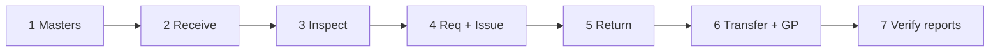

| Step | What to do |
|:----:|------------|
| 1️⃣ | **Masters** — org, OU, location, units, one asset + one consumable, vendor, employee with role + login |
| 2️⃣ | **Opening Stock** or **GRN** — receive asset with serial and consumable qty |
| 3️⃣ | If inspection-needed — **Inspection Approval** → home store |
| 4️⃣ | **Requisition** → **Store Issue** (pick serial for asset) |
| 5️⃣ | **Material Return** — return the allotted asset |
| 6️⃣ | **Transfer (OU)** → **Gatepass Outward** (returnable) → **Gatepass Inward** |
| 7️⃣ | Open **Stock Ledger** / **Stock Owner** / **Dashboard** to verify |

---

## 8. 📚 Related docs in this repo

| File | Content |
|------|---------|
| [`CAITS_PRODUCT_FUNCTIONAL_GUIDE.pdf`](CAITS_PRODUCT_FUNCTIONAL_GUIDE.pdf) | Printable PDF (diagrams + images) |
| [`CAITS_PRODUCT_FUNCTIONAL_GUIDE.md`](CAITS_PRODUCT_FUNCTIONAL_GUIDE.md) | This guide (flows, diagrams, images) |
| [`images/`](images/) | Cover, role art, and SVG flow diagrams |
| [`CAITS_FULL_SYSTEM_DOCUMENTATION.md`](CAITS_FULL_SYSTEM_DOCUMENTATION.md) | Deeper technical / schema write-up |
| [`DEMO_UI_WORKFLOW_RUN.md`](DEMO_UI_WORKFLOW_RUN.md) | Demo UI workflow notes |
| [`../db_approach/CAIMS_Relational_Schema.md`](../db_approach/CAIMS_Relational_Schema.md) | Relational schema notes |
| [`../README.md`](../README.md) | Project entry / run instructions |

---

### Viewing tips

| Viewer | What works best |
|--------|-----------------|
| **GitHub / GitLab** | PNGs, SVGs, and Mermaid diagrams |
| **VS Code / Cursor** | Open preview (`Markdown: Open Preview`) for Mermaid + images |
| **PDF export** | Use a Markdown→PDF tool that supports Mermaid (or rely on the SVG images) |

---

*Aligned with current CAITS behaviour (masters, transactions, quarantine/inspection, gatepass, reports). Update this file and `docs/images/` when major workflows change.*
