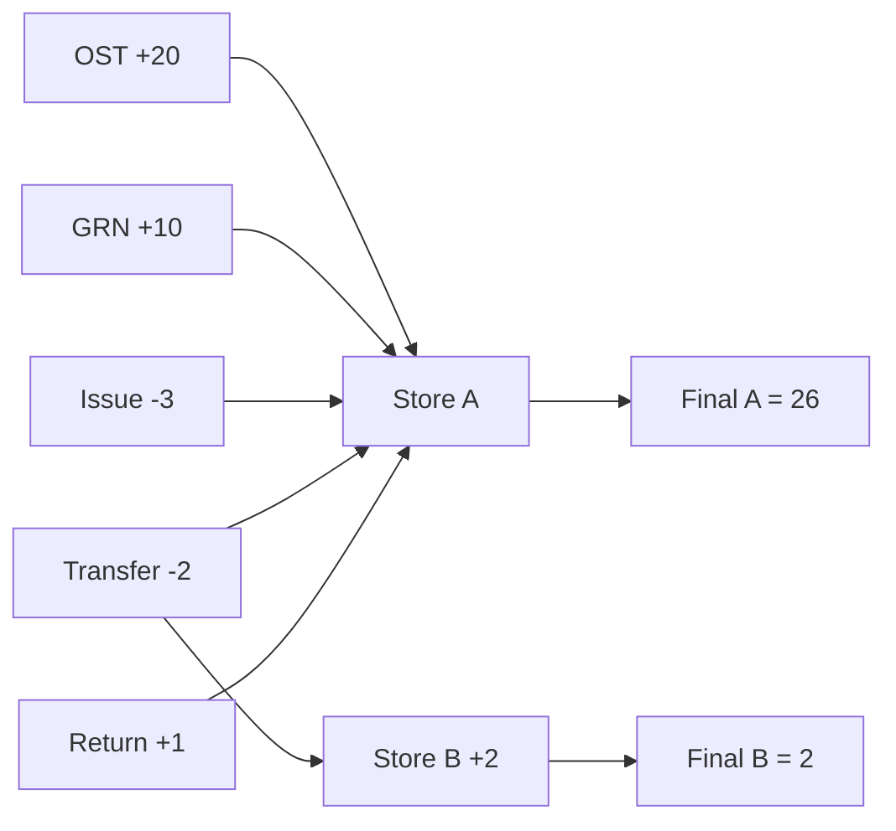

# Demo UI Workflow Run — DEMO-UI-20260804-1046

**Login:** `admin` / `Admin@123`  
**Created via API** so you can open the same records in the UI.

## Masters (search codes starting with DEMO-)

| Master | Code / Name | Where in UI |
|--------|-------------|-------------|
| Unit | DEMO-UOM | Masters → Unit |
| Category | DEMO-CAT | Masters → Inventory Category |
| Sub-category | DEMO-SUB (under DEMO-CAT) | Masters → Inventory Sub-Category |
| Organization | DEMO-ORG | Masters → Organization |
| Operating Unit | DEMO-OU | Masters → Operating Unit |
| Store A | DEMO-STR-A | Masters → Location |
| Store B | DEMO-STR-B | Masters → Location |
| Vendor | DEMO-VND | Masters → Vendor/Party |
| Item | **DEMO-ITEM-20260804-1046** | Masters → Item |

Employee used for approve/issue: ADMIN id=1 (System)

## Transactions (filter/search remarks containing `DEMO-UI-20260804-1046`)

| Step | Document | Doc No | Status | Stock effect |
|------|----------|--------|--------|--------------|
| 1 | Opening Stock | OST-2026-0003 | Completed | +20 @ DEMO-STR-A |
| 2 | GRN | GRN-2026-0002 | Completed | +10 accepted (12 received, 2 rejected) |
| 3 | Requisition | MREQ-2026-0001 | Approved | no stock change |
| 4 | Material Issue | MISS-2026-0001 | Completed | -3 (linked to requisition) |
| 5 | Transfer | MTRF-2026-0001 | Completed | -2 A / +2 B |
| 6 | Return | MRET-2026-0001 | Completed | +1 @ A |

## Final stock (analyze in Stock Register)

| Item | Location | Qty |
|------|----------|-----|
| DEMO-ITEM-20260804-1046 | DEMO-STR-A | **26.000** (expect 26) |
| DEMO-ITEM-20260804-1046 | DEMO-STR-B | **2.000** (expect 2) |

Math: 20 (OST) + 10 (GRN) - 3 (Issue) - 2 (Transfer) + 1 (Return) = **26** at Store A; Transfer **+2** at Store B.

## How to analyze in UI

1. Login as `admin` / `Admin@123`
2. Open each **Master** page and search `DEMO-`
3. Open **Opening Stock / GRN / Requisitions / Issues / Transfers / Returns** and find docs above
4. Open **Reports → Stock Register**, filter location DEMO-STR-A / DEMO-STR-B or search `DEMO-ITEM-20260804-1046`
5. Open **Reports → Full Report**, filter dates today and look for the doc numbers

## Stock story flowchart

## Low-stock follow-up run

| Field | Value |
|-------|-------|
| Item | `DEMO-LOW-112112` — Demo Toner Cartridge |
| Store | `DEMO-STR-A` |
| Opening Stock | `OST-2026-0004` (+12) |
| Requisition | `MREQ-2026-0002` (Approved) |
| Material Issue | `MISS-2026-0002` (−8) |
| Reorder level | **10** |
| Closing qty | **4** |
| Status | **Low Stock** (4 ≤ 10) |

Math: 12 − 8 = 4 on hand, reorder 10 → Dashboard Low Stock KPI = 1.

Refresh Dashboard to see the orange alert banner and **Low stock alerts** panel.
